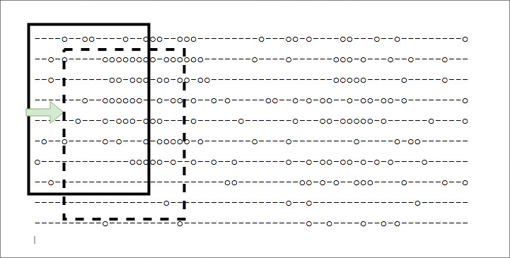

## Detect invaders in noisy radar image
  
### Problem
We have [this noisy radar image](radar_files/sample_one), and also two kind of invader's shape: [F11](radar_files/f11) and [F8](radar_files/f8). Find these shapes in noisy image.  
  
### Solution
- Create a snapshots (windows) from noisy radar image. These windows are created by shifting one item to right or bottom at the end of line.  
  
  
- Select the windows which are suspicious of containing invader's shape and ignore the rest.
- Examine the suspicious windows for invader's shape. Based on similarity percentage, mark it as invader or ignore it.
- List all founded invaders.  

### Tips
- When percentage of similarity goes over a specific number, then we mark it as a invader. This value can be changed in `DetectInvader` class.
- The above percentage is different for edge cases. 

### Run solution
run `ruby main.rb`

### Run test
run `rake test`